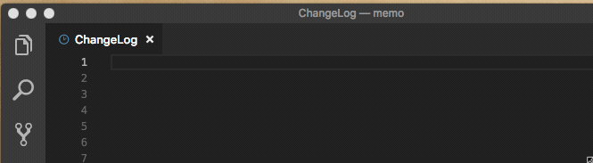

# changelog-support

Visual Studio Code extension for support Writing ChangeLog.

Note:
Rather than writing software changes, I assume that we will use the ChangeLog form for taking notes.

## Features

- ChangeLog syntax highlighting
- Insert headline (date & mail address)
- Insert item(tag) set (for weekday / weekend)
- Snippet for input item(tag)

### insert items



### snippet


## Extension Settings

This extension contributes the following settings:

- `changelog.mailaddress`: your mail address for headline
- `changelog.weekdayitems`: items(tags) you use in weekday.
- `changelog.weekenditems`: items(tags) you use in weekend.

example:
```json
"changelog.mailaddress": "your@mail.address",
"changelog.weekdayitems": [
    "task",
    "meeting",
    "development"
],
"changelog.weekenditems": [
    "driving",
    "fishing"
]
```

ChageLog image

```
2018-06-08 金  <kondoh@local>

	* task:チケット更新
	* meeting:仕様検討
	UI コンポーネントの振る舞い変更
	* development:
	バリデーション機能実装
```

## Release Notes

### 0.0.1

Initial release

### 0.0.2

Integrate syntax highliting & snippet
